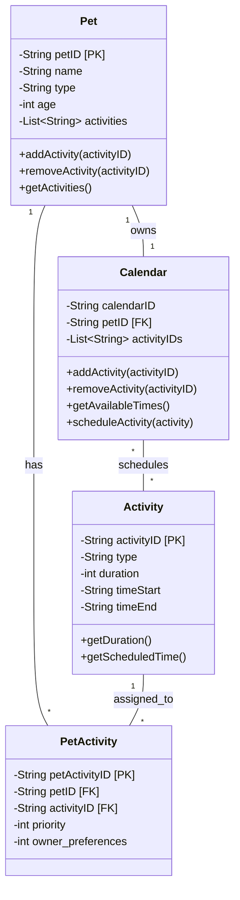

# PawPal+ Class Diagram

## Class Diagram

## Component Explanations

### Pet
Root entity representing a pet. Contains basic info (name, type, age) and maintains a list of activity IDs assigned to this pet.

### PetActivity
Junction table connecting Pet and Activity. Stores the relationship-specific attributes: `priority` and `owner_preferences`. This allows different pets to have different priority/preference scores for the same activity type.

### Activity
Reusable activity template with fixed properties. Multiple pets can be assigned to the same activity type with different priorities.

### Calendar
Owner's schedule manager. Associates a pet with scheduled activities and tracks available time slots for planning.

## Relationships

### Pet → PetActivity (1:M)
One pet can have many pet-activity pairings. A single pet (e.g., "Biscuit") is assigned to multiple activities, each with its own priority/preference.

### Activity → PetActivity (1:M)
One activity type can be assigned to many pets. The same activity (e.g., "morning walk") can appear in multiple pet-activity records with different priorities depending on the pet.

### Pet → Calendar (1:1)
Each pet has one calendar. The calendar tracks what's scheduled for that specific pet and when the owner is free.

### Calendar → Activity (M:M)
A calendar schedules many activities; activities can be scheduled on multiple calendars (e.g., same walk task for different pets on the same day).

## 🚩 Ambiguities & Questions

### 1. Duration vs. timeStart/timeEnd
You have three temporal fields in Activity: `duration`, `timeStart`, `timeEnd`. These are redundant—duration = timeEnd - timeStart. Which is the source of truth?
- Is duration the primary field and times are computed?
- Or are timeStart/timeEnd fixed slots (e.g., "walks are always 8:00–8:30 AM")?
- Are activities "floating" (fit into any available slot) or "fixed" (specific times only)?

### 2. Activity type: enum or string?
Is `type` a restricted set ("WALK", "FEEDING", "MEDS", "ENRICHMENT", "GROOMING") or a free-form string? This affects validation and scheduling logic.

### 3. What do priority and owner_preferences mean?
On PetActivity:
- `priority` (0-5): Is this how important the task is (5 = must do today, 0 = optional)?
- `owner_preferences` (0-5): Is this how much the owner likes doing it, or how much the pet likes it?
- How do these two scores interact when generating a schedule?

### 4. What are "available times" in Calendar?
`getAvailableTimes()` is vague. Does this mean:
- Owner's free windows in the day?
- Pet's available windows (when it's not sleeping/resting)?
- Gaps in the current schedule?
- Should there be a separate `Constraint` or `Availability` entity?

### 5. Calendar scope: daily, weekly, or rolling?
Is each Calendar a day-view, week-view, or a rolling forecast? Should Calendar have a `date` field to indicate which day it represents?

### 6. Where does the scheduling engine live?
The README mentions generating a "daily plan." Should the scheduling logic live in:
- Calendar's `scheduleActivity()` method?
- A separate `Scheduler` class?
- How does it handle conflicts (two overlapping activities)?

### 7. Are activities recurring or one-time?
The README mentions "recurring tasks" (daily vs. weekly). How are these stored?
- Is there a `recurrence` field on Activity?
- Or does the Scheduler generate multiple Activity instances?
